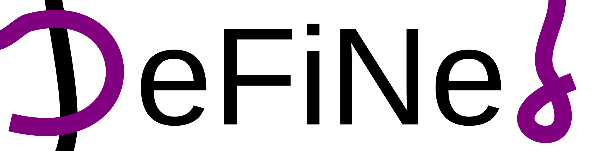
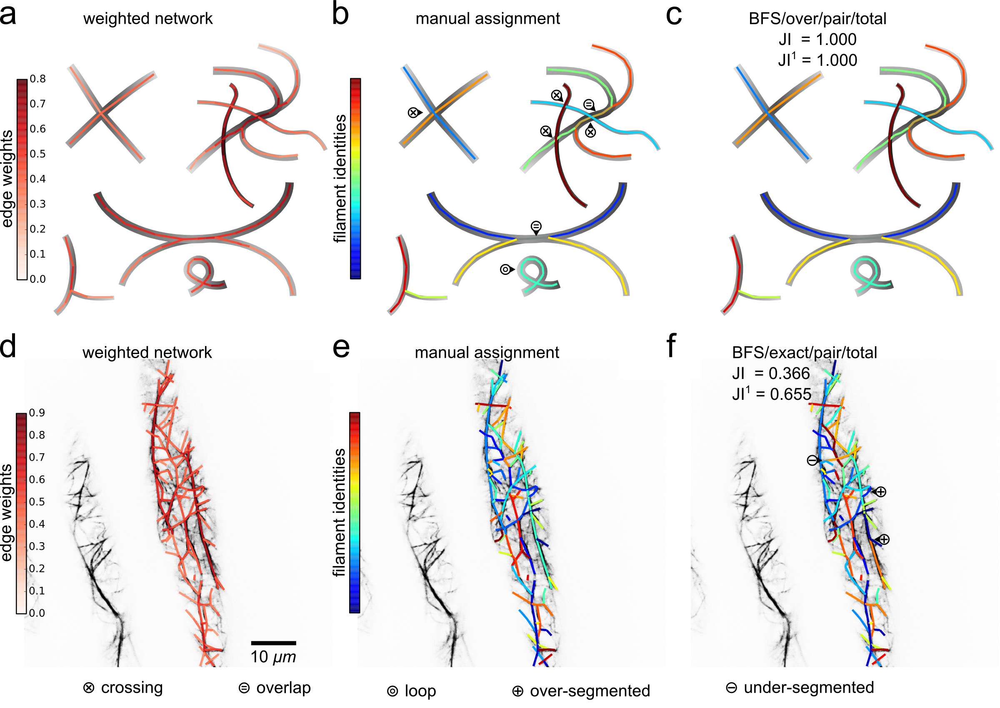

**De(composing) Fi(lamentous) Ne(tworks)**

Thread-like structures are pervasive across scales, from polymeric proteins to root systems to galaxy filaments,
and their characteristics can be readily investigated in the network formalism. Yet, network links usually represent only parts of filaments,
which, when neglected, may lead to erroneous conclusions from network-based analyses.
The existing alternatives to detect filaments in network representations require tuning of parameters over a large range of values and treat all filaments equally,
thus, precluding automated analysis of diverse filamentous systems. Here, we propose a fully automated and robust optimisation-based approach to detect
filaments of consistent intensities and angles in a given network. We test and demonstrate the accuracy of our solution with contrived, biological,
and cosmic filamentous structures. In particular, we show that the proposed approach provides powerful automated means to study properties of individual actin filaments
in their network context.

(A-C) Contrived filamentous network extracted from underlying drawing.
(D-E) Actin cytoskeletal network extracted from underlying confocal microscopy recording.

Please see [project website for details](http://mathbiol.mpimp-golm.mpg.de/DeFiNe/).

**Instructions**

Install package via:

- sudo pip2 install -e .

Run program via:

- run_DeFiNe.py OR
- cd bin && python2 run_DeFiNe.py

**Citation**

If this software is useful for your work, please include the following reference in your publication or redistribution:

Breuer and Nikoloski (2015) DeFiNe: an optimisation-based method for robust disentangling of filamentous networks. Sci. Rep., 5:18267.

Breuer et al. (2017) System-wide organization of actin cytoskeleton determines organelle transport in plant hypocotyl cells. PNAS, 10.1073/pnas.1706711114.

